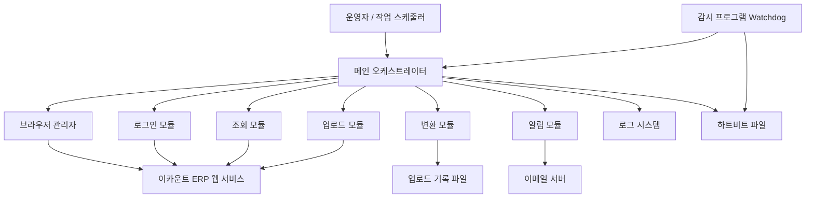
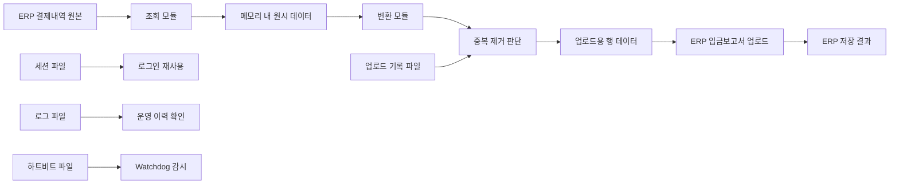

# 시스템 개요서

> 대상 시스템: 이카운트 ERP 결제내역 자동 업로드 자동화
> 목적: 비기술자 이해 + 차기 개발자 온보딩
> 기준 시점: 현재 저장소 구현 기준

## 1. 한눈에 보는 시스템

이 시스템은 사람이 ERP 화면에 들어가 반복해서 하던 작업을 대신합니다.

- 결제내역조회 화면에서 미처리 결제 데이터를 읽습니다.
- 이미 반영된 건은 걸러냅니다.
- 입금보고서 형식으로 바꿉니다.
- 다시 ERP의 입금보고서 화면으로 이동해 업로드합니다.
- 오류가 나면 이메일로 알리고, 운영 중단을 막기 위해 감시 장치도 함께 둡니다.

핵심 철학은 단순합니다.

1. 사람이 하던 클릭 순서를 최대한 그대로 자동화한다.
2. 잘못 올리는 것보다, 안 올리고 멈추는 쪽이 더 안전하다고 본다.
3. 한 번 성공한 기록은 남겨서 중복 업로드를 줄인다.
4. 운영은 Windows 중심, 개발·수정은 Mac에서도 가능하게 분리한다.

---

## 2. 비즈니스 프로세스 맵

### 사용자 여정

### 이 흐름이 중요한 이유

- 운영자는 “언제 실행되고 어디서 실패하는지”를 한 장으로 이해할 수 있습니다.
- 다음 개발자는 “어느 단계가 조회, 판단, 저장 역할인지”를 빠르게 구분할 수 있습니다.

---

## 3. 시스템 컴포넌트 구조도

### 조감도

### 역할별 설명

| 덩어리 | 하는 일 | 현실 비유 |
|---|---|---|
| 메인 오케스트레이터 | 전체 순서를 지휘 | 현장 반장 |
| 브라우저 관리자 | 브라우저 실행, 종료, 세션 재사용 | 운전기사와 차량 관리 |
| 로그인 모듈 | ERP 입장 절차 처리 | 출입 게이트 통과 |
| 조회 모듈 | 결제내역 화면에서 자료 읽기 | 창고에서 물건 목록 확인 |
| 변환 모듈 | ERP 원본을 업로드용 표로 바꿈 | 물건을 출고 양식에 맞게 다시 포장 |
| 업로드 모듈 | 입금보고서 화면에 붙여넣고 저장 | 접수 창구에 서류 제출 |
| 알림 모듈 | 에러/요약 메일 발송 | 이상 발생 시 관리자에게 전화 |
| Watchdog | 멈춤 감시 후 재시작 | 야간 경비원 |

---

## 4. 데이터 흐름도

### 중요한 데이터가 이동하는 길

### 데이터별 의미

| 데이터 | 생성 위치 | 저장 위치 | 쓰임새 |
|---|---|---|---|
| 로그인 세션 | 로그인 성공 직후 | `sessions/session.json` | 재로그인 횟수 감소, 속도 향상 |
| 결제내역 원본 | ERP 조회 화면 | 메모리 중심, 임시 처리 | 업로드 대상 선별 |
| 업로드용 데이터 | 변환 모듈 | 메모리 중심, 클립보드 거침 | 입금보고서 업로드 |
| 업로드 기록 | 업로드 성공 직후 | `uploaded_records.json` | 로컬 중복 방지 |
| 로그 | 실행 전 과정 | `logs/` | 문제 추적, 운영 확인 |
| 하트비트 | 주기 루프 | `heartbeat.txt` | 멈춤 감지, 자동 재시작 |

### 데이터 흐름의 핵심 포인트

- 이 시스템은 “DB 중심”이 아니라 “ERP 화면 중심”입니다.
- 영구 저장소는 최소한만 사용합니다.
- 따라서 정확도는 화면 구조와 셀렉터 안정성에 크게 의존합니다.

---

## 5. 확장 및 유지보수 가이드

### 다음 기능을 붙일 때 어디를 건드리면 되는가

| 추가/변경 목표 | 주요 연결 지점 | 먼저 봐야 할 파일 | 설명 |
|---|---|---|---|
| 로그인 방식 변경 | 로그인 단계 | `modules/login.py`, `core/browser.py` | 인증 화면 구조가 바뀌면 가장 먼저 영향 받음 |
| 조회 조건 추가 | 결제내역 조회 단계 | `modules/reader.py` | 필터 탭, 컬럼 읽기, 화면 이동 로직 수정 |
| 업로드 형식 변경 | 데이터 변환 단계 | `modules/transformer.py` | 어떤 열을 어떤 값으로 채울지 여기서 결정 |
| 저장 절차 변경 | 최종 제출 단계 | `modules/uploader.py` | 팝업, 붙여넣기, 저장 성공 판정이 바뀜 |
| 알림 채널 추가 | 오류 대응 단계 | `modules/notifier.py` | 이메일 외 메신저나 슬랙 확장 지점 |
| 운영 시간 변경 | 실행 정책 | `utils/config.py`, `main.py` | 시간대, 반복 주기, 테스트/운영 분기 수정 |
| 감시 체계 강화 | 운영 안정성 | `watchdog.py`, 스케줄러 배치 파일 | 재시작 기준, 감시 간격 조정 |

### 기능 확장 방법의 원칙

1. 새로운 업무 규칙은 먼저 “변환 단계”에 넣을지 “조회 단계”에 넣을지 구분합니다.
2. 화면 이동이나 버튼 클릭 변화는 “업로드/조회 모듈”에서 해결하고, 메인 흐름은 가능한 그대로 둡니다.
3. 운영 안정성 기능은 업무 로직과 분리해서 유지합니다.

### 현재 구조에서 위험도가 높은 주의 구간

| 주의 구간 | 위험도 | 이유 | 변경 시 주의점 |
|---|---|---|---|
| ERP 화면 셀렉터 의존 구간 | 높음 | 화면 이름, 탭, 컬럼 구조가 바뀌면 즉시 실패 | UI 변경 시 가장 먼저 테스트 필요 |
| 업로드 성공 판정 구간 | 높음 | 팝업 문구 변화에 민감 | 성공/실패 메시지 기준을 함께 갱신해야 함 |
| 중복 제거 기준 | 높음 | 잘못 바꾸면 누락 업로드 또는 중복 업로드 발생 | 로컬 기록과 ERP 반영 기준을 동시에 검토 |
| 운영 환경 의존 구간 | 높음 | 현재 운영 로직은 Windows 명령과 절전 제어에 기대고 있음 | Mac에서 개발 가능해도 운영은 별도 검증 필요 |
| 세션 재사용 구간 | 중간 | 세션 만료 시 로그인 실패로 이어질 수 있음 | 쿠키 저장과 만료 처리 정책 확인 |
| 스케줄/요약 리포트 구간 | 중간 | 하루 통계 초기화 시점이 운영 판단에 영향 | 업무 종료 시각 변경 시 같이 수정 |

---

## 6. 기술 스택 설명

### 무엇을 썼고, 왜 썼는가

| 기술/도구 | 역할 | 선택 이유 | 현실 비유 |
|---|---|---|---|
| Python | 전체 자동화의 기본 언어 | 빠르게 읽고 고치기 좋고, 업무 자동화에 적합 | 현장 작업을 지시하는 공용 언어 |
| Playwright | ERP 웹 화면 자동 조작 | 브라우저 제어, 로그인, 클릭, 붙여넣기 자동화에 강함 | 사람 손 대신 마우스와 키보드를 움직이는 로봇 팔 |
| Chromium | 실제 작업 브라우저 | Playwright와 궁합이 좋고 재현성이 높음 | 자동화 전용 작업 차량 |
| JSON 설정 | 계정, 모드, URL, 시간 정책 보관 | 코드 수정 없이 운영값 변경 가능 | 현장 작업 지시서 |
| 세션 파일 | 로그인 상태 재사용 | 매번 처음부터 로그인하지 않아도 됨 | 출입증 보관함 |
| 로그 파일 | 실행 흔적 기록 | 실패 시 원인 추적 가능 | CCTV 기록 |
| 업로드 기록 파일 | 이미 올린 건 기억 | 중복 방지 | 출고 완료 도장 목록 |
| 이메일 알림 | 운영자 통보 | 에러를 바로 인지할 수 있음 | 경보 문자 |
| Watchdog | 멈춤 감시 및 재시작 | 장시간 무응답 상황에 대한 안전장치 | 야간 순찰자 |
| Windows 작업 스케줄러 | 매일 재시작 및 운영 자동화 | 운영 PC에서 별도 서버 없이 사용 가능 | 정해진 시간에 문 여닫는 관리실 |

### 왜 서버나 데이터베이스 중심 구조가 아닌가

이 시스템은 웹 서비스 자체를 새로 만든 것이 아니라, 기존 ERP를 “대신 조작하는 자동화 도우미”에 가깝습니다.

- 서버형 플랫폼을 새로 구축하는 것보다 빠르게 현업 문제를 해결할 수 있습니다.
- 대신 화면 구조가 바뀌면 영향을 크게 받는다는 한계가 있습니다.

즉, 이 시스템은 “24시간 열려 있는 창고를 새로 짓는 방식”이 아니라, “기존 창고에 대신 들어가 정해진 작업을 반복하는 숙련 작업자”에 가깝습니다.

---

## 7. 운영 관점에서 꼭 알아야 할 점

### 현재 구조의 성격

- 개발은 Mac에서도 가능하지만, 실제 운영 로직은 Windows 중심입니다.
- 이유는 절전 방지, 프로세스 정리, 자동 재시작, 작업 스케줄러가 모두 Windows 운영을 기준으로 설계되어 있기 때문입니다.
- 따라서 차기 개발자가 Mac에서 기능을 수정하더라도, 최종 검증은 Windows 운영 환경에서 다시 해야 합니다.

### 운영 안정성 장치

이 구조는 “한 번 잘 도는 것”보다 “오래 멈추지 않고 도는 것”을 우선합니다.

---

## 8. 차기 개발자용 빠른 이해 포인트

### 먼저 이해해야 할 순서

1. 전체 흐름은 `main.py`가 지휘합니다.
2. 실제 업무 로직은 `modules/` 아래에 나뉘어 있습니다.
3. 브라우저 시작·세션은 `core/browser.py`가 책임집니다.
4. 운영값은 `utils/config.py`에서 읽습니다.
5. 운영 장애 대응은 `watchdog.py`와 배치 파일 계열이 담당합니다.

### 설계 의도

- “업무 흐름”과 “운영 안정성”을 분리하려고 한 구조입니다.
- 따라서 기능을 추가할 때는 업무 규칙인지, 운영 제어인지 먼저 구분하는 것이 중요합니다.
- 이 구분이 흐려지면 작은 수정이 전체 운영 장애로 번질 수 있습니다.

---

## 부록 A. 초보자용 용어 설명

| 용어 | 쉬운 설명 |
|---|---|
| API | 프로그램끼리 약속된 방식으로 대화하는 창구 |
| DB | 데이터를 오래 보관하는 창고 |
| 서버 | 요청을 받아 계속 일을 처리하는 상시 근무 컴퓨터 |
| 브라우저 자동화 | 사람이 웹사이트에서 하던 클릭과 입력을 프로그램이 대신하는 것 |
| 세션 | 로그인한 상태를 잠시 기억해 두는 표식 |
| 로그 | 프로그램이 언제 무엇을 했는지 남긴 기록 |
| 스케줄러 | 정해진 시간에 프로그램을 실행해 주는 도구 |
| Watchdog | 멈춤 여부를 감시하는 보조 프로그램 |
| 셀렉터 | 웹 화면에서 특정 버튼이나 칸을 찾기 위한 위치 정보 |
| 클립보드 | 복사/붙여넣기할 때 잠시 내용이 머무는 공간 |
| 헤드리스 | 화면을 띄우지 않고 백그라운드로 브라우저를 실행하는 방식 |
| 오케스트레이터 | 여러 기능을 순서대로 묶어 전체 흐름을 조율하는 중심 역할 |

---

## 부록 B. 이 문서를 읽은 뒤 바로 할 수 있는 판단

- 운영자는 “어디서 오류가 날 수 있는지”를 단계별로 볼 수 있습니다.
- 기획자는 “새 기능이 조회 쪽인지, 업로드 쪽인지”를 구분할 수 있습니다.
- 차기 개발자는 “어느 파일이 연결 지점인지”를 보고 바로 진입할 수 있습니다.
