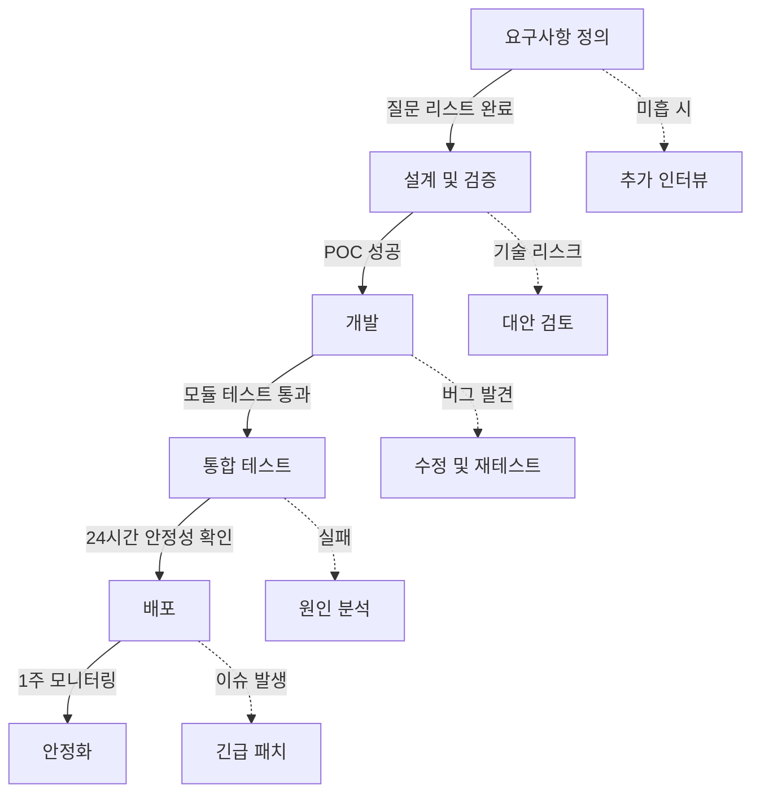

# 회계 ERP 자동화 프로젝트 개발 회고

## 프로젝트 개요
- **프로젝트명**: 이카운트 웹 자동화 시스템 V9.5
- **기간**: 2026-01-05 ~ 2026-01-08
- **목적**: 카드 결제 내역을 ERP 시스템에 자동 업로드
- **주요 기술**: Python, Playwright, 브라우저 자동화

---

## 1. 예상하지 못한 변수/엣지케이스 목록

### 1.6 날짜별 로그 파일 관리 문제

**발생 상황:**
- 프로그램이 24시간 연속 실행되면서 같은 로그 파일에 계속 기록
- 날짜가 바뀌어도 로그 파일명이 갱신되지 않음
- 로그 분석 시 날짜 구분이 어려움

**왜 사전에 파악하지 못했나:**
- Logger가 프로그램 시작 시 한 번만 초기화됨
- 장시간 실행 시 로그 관리 전략 미수립
- 일일 단위 분석 요구사항 미반영

**해결 방법:**
```python
# 날짜 변경 감지 및 프로그램 자동 재시작
start_date = datetime.now().date()

while True:
    current_date = datetime.now().date()

    # 날짜가 바뀌고 업무시간(06:00) 도달 시
    if current_date > start_date and current_time >= "06:00":
        logger.info("🔄 새로운 날 시작 - 프로그램 재시작 (로그 파일 갱신)")
        sys.exit(0)  # 배치 파일이 자동으로 재시작
```

**자동 재시작 배치 파일:**
```batch
:restart
python main.py
timeout /t 5 /nobreak
goto restart
```

**교훈:**
- 장시간 실행 프로그램은 로그 로테이션 전략 필수
- 날짜 기반 작업은 날짜 변경 이벤트 처리 필요
- 단순 재시작이 복잡한 로직보다 안정적일 수 있음

---

### 1.7 버전 불일치 문제

**발생 상황:**
- 01/07 07:02에 실행된 프로그램이 C-1 수정 전 버전
- 로그 메시지 분석으로 구버전 실행 확인
  - 구버전: `🛑 브라우저 종료`
  - 신버전: `🛑 브라우저 종료 완료 (Playwright 인스턴스 유지)`
- 27시간 동안 Event Loop 에러 반복

**왜 사전에 파악하지 못했나:**
- 코드 수정 후 실행 중인 프로세스를 종료하지 않음
- 파일 시스템의 코드와 실행 중인 코드의 차이 미인지
- 버전 확인 메커니즘 부재

**해결 방법:**
```python
# 1. 버전 정보를 로그에 명시
VERSION = "V13.0"
logger.info(f"🚀 이카운트 웹 자동화 {VERSION} 실행")

# 2. 중요 수정 후 재시작 알림
logger.info("=" * 60)
logger.info("⚠️ 코드 수정 완료 - 프로그램을 재시작하세요")
logger.info("=" * 60)

# 3. 로그 메시지 차별화로 버전 식별 가능하게
# Bad: logger.info("브라우저 종료")
# Good: logger.info("브라우저 종료 완료 (Playwright 인스턴스 유지)")
```

**교훈:**
- 버전 정보를 명시적으로 로깅
- 중요 수정 후 반드시 프로세스 재시작 확인
- 로그 메시지로 버전 역추적 가능하도록 설계

---

### 1.8 결제 상태 값의 다양성

**발생 상황:**
- 초기에는 '정상', '취소'만 고려
- 운영 중 '승인실패', '취소실패', '요청중' 등 발견
- 미처리 상태로 인한 잘못된 업로드 가능성

**왜 사전에 파악하지 못했나:**
- 실제 운영 데이터 샘플 부족
- 결제 시스템의 전체 상태 머신 미파악
- 예외 케이스에 대한 질문 누락

**해결 방법:**
```python
# 무효 상태 필터링
INVALID_STATUSES = ['승인실패', '취소실패', '요청중']

if status in INVALID_STATUSES:
    logger.info(f"⏩ 데이터 제외: 상태 {status}")
    continue

# 정상 처리
if status == '취소':
    amount = f"-{amount}"  # 음수 처리
else:  # '정상' 등
    amount = amount
```

**교훈:**
- 상태값의 모든 가능한 경우의 수 사전 확인
- Enum 또는 상수로 명시적 정의
- 새로운 상태 발견 시 빠른 대응 체계 필요

---

## 1. 예상하지 못한 변수/엣지케이스 목록 (기존 내용)

### 1.1 Event Loop 영구 종료 문제 (C-1 이슈)

**발생 상황:**
- 브라우저 종료(`close()`) 시 `playwright.stop()`을 호출
- 이로 인해 Event Loop가 영구적으로 종료됨
- 다음 사이클에서 브라우저를 다시 시작할 수 없음
- 로그: `RuntimeError: Event loop is closed` 반복 발생 (16회)

**왜 사전에 파악하지 못했나:**
- Playwright의 생명주기 관리에 대한 이해 부족
- `close()`와 `stop()`의 차이를 명확히 구분하지 않음
- 단일 사이클 테스트로는 발견할 수 없는 다중 사이클 이슈

**해결 방법:**
```python
# Before (문제)
def close(self):
    if self.page:
        self.page.close()
    if self.playwright:
        self.playwright.stop()  # ❌ Event Loop 종료

# After (해결)
def close(self):
    """단일 사이클 종료 - 브라우저만 닫음"""
    if self.page:
        self.page.close()
    # playwright 인스턴스는 유지

def shutdown(self):
    """프로그램 완전 종료 시에만 호출"""
    if self.playwright:
        self.playwright.stop()
```

**교훈:**
- 리소스 생명주기를 명확히 구분 (사이클 vs 프로그램 전체)
- 반복 작업에서는 리소스 재사용 고려

---

### 1.2 절전 모드로 인한 프로세스 정지

**발생 상황:**
- 01/07 18:16에 시작된 프로세스가 다음날 06:00에 작동하지 않음
- 로그가 18:16:41 이후 전혀 업데이트되지 않음
- Python 프로세스는 살아있지만 응답 없는 상태(Hung)

**왜 사전에 파악하지 못했나:**
- Windows 절전 모드의 영향을 고려하지 않음
- 업무 시간 외에는 절전 방지 기능을 해제하는 로직 설계
- 야간 테스트를 수행하지 않음

**해결 방법:**
```python
# Before (문제)
if self.is_work_time():
    self.set_keep_alive(True)  # 업무 시간만 활성화
else:
    self.set_keep_alive(False)  # ❌ 야간에 절전 허용 → 프로세스 정지

# After (해결)
try:
    # 프로그램 실행 중에는 항상 절전 방지 활성화
    self.set_keep_alive(True)

    while True:
        # 업무 시간 체크는 작업 실행 여부만 결정
        if self.is_work_time():
            self.single_cycle()
        else:
            # 대기만 하고 절전 방지는 유지
            time.sleep(600)
finally:
    # 프로그램 종료 시에만 절전 허용
    self.set_keep_alive(False)
```

**교훈:**
- 장시간 실행 프로그램은 OS 절전 정책 고려 필수
- 야간/주말 포함 전체 스케줄 시뮬레이션 필요

---

### 1.3 팝업 처리 타이밍 이슈

**발생 상황:**
- 저장 버튼 클릭 후 결과 팝업이 즉시 나타나지 않음
- 고정 대기 시간으로는 불안정함
- 간헐적으로 팝업을 놓치는 경우 발생

**왜 사전에 파악하지 못했나:**
- 네트워크 속도, 서버 응답 시간 변동성을 고려하지 않음
- 로컬 테스트 환경과 실제 환경의 차이

**해결 방법:**
```python
# Before (문제)
page.click("저장버튼")
time.sleep(2)  # ❌ 고정 대기
popup = context.pages[-1]

# After (해결)
page.click("저장버튼")
popup = None
for attempt in range(5):  # 최대 5초 대기
    time.sleep(1)
    if len(context.pages) > 1:
        popup = context.pages[-1]
        logger.info(f"✅ 새 팝업 감지 ({attempt + 1}초 후)")
        break
```

**교훈:**
- 외부 시스템 응답은 항상 동적 대기(polling) 방식 사용
- 타임아웃과 재시도 로직 필수

---

### 1.4 이메일 인증 실패 (Gmail App Password)

**발생 상황:**
- 일반 비밀번호로 SMTP 인증 시도 시 실패
- 에러: `Application-specific password required`

**왜 사전에 파악하지 못했나:**
- Gmail의 2단계 인증 정책 변경 미인지
- 앱 비밀번호 개념에 대한 사전 조사 부족

**해결 방법:**
1. Gmail 계정에서 2단계 인증 활성화
2. 앱 비밀번호 생성
3. 공백 제거한 16자리 비밀번호 사용

**교훈:**
- 외부 서비스(이메일, API 등) 인증 정책 사전 확인
- 테스트 환경에서 먼저 검증

---

### 1.5 중복 데이터 처리 전략

**발생 상황:**
- 로컬 JSON 파일만으로는 완벽한 중복 제거 불가능
- 수동 업로드 또는 다른 경로로 입력된 데이터와 중복 가능

**왜 사전에 파악하지 못했나:**
- 단일 자동화 프로세스만 가정
- 사용자의 수동 개입 가능성 미고려

**해결 방법:**
```python
# 3단계 중복 체크
1. 로컬 JSON 기록 대조 (작업 일시 기준)
2. 실시간 ERP '회계반영' 내역 대조 (승인번호 기준)
3. 데이터 무결성 검증 (필수값 누락, 실패 건 제외)
```

**교훈:**
- 다중 진입점 시스템은 여러 레이어의 중복 방지 필요
- 단일 식별자(승인번호)와 복합 식별자(일시+고객) 병용

---

## 2. 기획 단계에서 놓친 검증 항목

### 2.1 기술 검증 체크리스트

#### 브라우저 자동화
- [ ] 대상 웹사이트의 iframe 구조 파악
- [ ] 동적 로딩 요소의 대기 시간 측정
- [ ] 팝업 출현 패턴 분석 (동기/비동기)
- [ ] 세션 유지 시간 및 재로그인 조건 확인
- [ ] 브라우저 리소스 누수 가능성 테스트
- [ ] Headless 모드와 일반 모드의 동작 차이 검증

#### 데이터 처리
- [ ] 원본 데이터의 모든 가능한 상태값 목록화
  - 정상, 취소, 승인실패, 취소실패 등
- [ ] 금액 표시 형식 및 음수 처리 규칙
- [ ] 날짜/시간 형식 통일 규칙
- [ ] 누락 가능한 필드 및 기본값 정의
- [ ] 특수문자 처리 방식

#### 시스템 운영
- [ ] 24시간 연속 실행 시 메모리/CPU 사용량
- [ ] 네트워크 단절 시 복구 시나리오
- [ ] 로그 파일 크기 관리 정책
- [ ] 세션 만료 시 재인증 흐름
- [ ] 예외 발생 시 재시도 정책

---

### 2.2 운영 환경 체크리스트

#### OS/시스템 설정
- [ ] Windows 절전 모드 설정 및 영향 범위
- [ ] 방화벽/보안 프로그램의 스크립트 실행 제한
- [ ] 시스템 시간대 및 시간 동기화 설정
- [ ] 디스크 공간 모니터링 및 정리 정책
- [ ] 사용자 권한 및 프로세스 우선순위

#### 네트워크
- [ ] SMTP 포트(587) 방화벽 허용 여부
- [ ] 대상 웹사이트 접속 가능 시간대
- [ ] VPN/프록시 사용 시 영향
- [ ] DNS 해석 실패 시 대응

#### 스케줄링
- [ ] 시작 시간과 업무 시간의 관계
- [ ] 공휴일/주말 처리 정책
- [ ] 야간 시간대 동작 방식
- [ ] 일일 보고서 발송 조건

---

### 2.3 데이터 품질 체크리스트

#### 입력 데이터
- [ ] 모든 필수 필드 존재 확인
- [ ] 데이터 타입 검증 (숫자, 날짜 등)
- [ ] 값의 범위 검증 (음수, 0, 최댓값)
- [ ] 특수 케이스 처리
  - 취소 거래
  - 부분 취소
  - 금액 0인 거래

#### 출력 데이터
- [ ] ERP 입력 형식 정확도
- [ ] 필수 컬럼 누락 방지
- [ ] 날짜 형식 통일 (`YYYY/MM/DD`)
- [ ] 금액 부호 규칙 (취소는 `-`)
- [ ] 적요명 생성 규칙

---

## 3. 반복된 디버깅 패턴

### 3.1 리소스 생명주기 관리 오류

**반복된 패턴:**
1. Event Loop 종료 문제 (C-1)
2. 브라우저 컨텍스트 누수
3. 세션 파일 잠금 문제

**공통점:**
- 리소스의 생성/사용/해제 시점이 불명확
- 단일 실행에서는 문제 없지만 반복 실행 시 발생
- finally 블록 미사용 또는 부적절한 사용

**근본 원인:**
```
부적절한 추상화 레벨
├─ 사이클 레벨 (30분마다 반복)
│  └─ 브라우저 close() ✓
└─ 프로그램 레벨 (하루 1번 시작/종료)
   └─ Playwright stop() ✓
```

**해결 원칙:**
- 리소스 계층 구조 명확히 정의
- 각 계층마다 적절한 cleanup 메서드 분리
- try-finally로 확실한 해제 보장

---

### 3.2 타이밍 관련 오류

**반복된 패턴:**
1. 팝업 대기 시간 부족
2. 데이터 로딩 미완료 상태에서 읽기 시도
3. 네트워크 지연 시 타임아웃

**공통점:**
- 고정 대기 시간 사용 (`time.sleep(N)`)
- 조건 확인 없이 다음 단계 진행
- 환경 변화에 취약한 구조

**근본 원인:**
```
동기적 사고방식
├─ "저장 후 2초면 충분하겠지" (X)
└─ "팝업이 나타날 때까지 기다리자" (O)
```

**해결 원칙:**
```python
# Bad
click_button()
time.sleep(2)
process_result()

# Good
click_button()
wait_until_condition(
    condition=lambda: popup_exists(),
    timeout=10,
    interval=0.5
)
process_result()
```

---

### 3.3 환경 의존성 문제

**반복된 패턴:**
1. 절전 모드로 인한 프로세스 정지
2. 인코딩 문제 (UTF-8 vs CP949)
3. 경로 구분자 차이 (Windows `\` vs Linux `/`)

**공통점:**
- 개발 환경과 운영 환경의 차이 미고려
- OS별 동작 차이 검증 부족
- 환경 변수나 설정 파일 미활용

**근본 원칙:**
- 환경별 설정 분리 (config.json)
- OS 감지 및 조건부 처리
- 절대 경로보다 상대 경로 선호

---

## 4. 다음 개발 시 사전 질문 리스트

### 4.1 기획 단계 질문 (사용자에게)

#### 시스템 운영 관련
1. **실행 환경**
   - PC는 24시간 켜두시나요, 아니면 특정 시간에만 작동하나요?
   - Windows 절전 모드 설정은 어떻게 되어 있나요?
   - 다른 자동화 프로그램이나 보안 소프트웨어가 실행 중인가요?

2. **업무 시간**
   - 정확한 업무 시작/종료 시간은 언제인가요?
   - 공휴일이나 주말에도 작동해야 하나요?
   - 야간 시간대(18:00~06:00)에는 어떻게 동작해야 하나요?

3. **오류 처리**
   - 오류 발생 시 어떻게 알림 받고 싶으신가요? (이메일, 문자, 로그만)
   - 자동 재시도를 몇 번까지 허용하시겠습니까?
   - 치명적 오류 시 프로그램을 중단할까요, 계속 실행할까요?

#### 데이터 처리 관련
4. **입력 데이터**
   - 결제 취소 건은 어떻게 처리해야 하나요?
   - 금액이 0원인 거래도 업로드하나요?
   - 동일한 데이터가 수동으로 입력될 가능성이 있나요?

5. **중복 처리**
   - 이미 업로드된 데이터를 재업로드하면 어떻게 되나요?
   - 중복 여부를 어떤 기준으로 판단하나요? (일시, 승인번호, 금액 조합 등)

6. **출력 형식**
   - ERP에 입력할 때 필수 필드는 무엇인가요?
   - 기본값으로 채워야 할 필드가 있나요?
   - 적요명 생성 규칙은 어떻게 되나요?

#### 알림 및 리포트
7. **일일 보고서**
   - 보고서 발송 시간은 언제가 좋으신가요?
   - 어떤 정보를 포함해야 하나요? (성공/실패 건수, 취소 건수 등)
   - 데이터가 0건일 때도 보고서를 보내드릴까요?

8. **로그 관리**
   - 로그는 얼마나 오래 보관하시겠습니까?
   - 디버깅 정보를 얼마나 상세히 남길까요? (간략/보통/상세)

---

### 4.2 기술 검증 단계 질문 (내부)

#### 웹 자동화
1. **브라우저 구조**
   - iframe이 몇 단계로 중첩되어 있는가?
   - 동적 로딩되는 요소는 무엇인가?
   - AJAX 요청 완료 시점을 어떻게 감지할 것인가?

2. **팝업/다이얼로그**
   - 저장 후 결과 팝업이 나타나는 시간은?
   - 팝업이 여러 개 동시에 뜰 수 있는가?
   - 팝업을 구분하는 고유 식별자는?

3. **세션 관리**
   - 세션 만료 시간은 얼마인가?
   - 재로그인이 필요한 조건은?
   - 쿠키만으로 세션 유지가 가능한가?

#### 데이터 처리
4. **데이터 상태**
   - 결제 상태의 모든 가능한 값은? (승인, 취소, 실패 외에 또 있는가?)
   - NULL 값이 들어올 수 있는 필드는?
   - 금액 표시에 천단위 쉼표가 포함되는가?

5. **예외 케이스**
   - 같은 시각에 동일 금액 결제가 여러 건 있을 수 있는가?
   - 승인번호가 중복될 가능성은?
   - 날짜가 미래 시점인 경우가 있는가?

#### 시스템 안정성
6. **리소스 관리**
   - 브라우저를 계속 재사용할 것인가, 매번 새로 시작할 것인가?
   - 메모리 누수 징후를 어떻게 감지할 것인가?
   - 로그 파일 크기 제한은?

7. **네트워크**
   - 네트워크 단절 시 재시도 정책은?
   - 타임아웃 설정은 얼마로?
   - VPN 사용 여부 및 영향?

---

## 5. 개선된 개발 프로세스

### 5.1 Phase 1: 요구사항 정의 (1일)

#### 1.1 사용자 인터뷰
- [ ] 4.1의 기획 단계 질문 리스트 작성 및 회신 요청
- [ ] 현재 업무 프로세스 관찰 및 기록
- [ ] 예외 케이스 시나리오 수집

#### 1.2 기술 조사
- [ ] 대상 웹사이트 수동 조작하며 구조 파악
  - 개발자 도구로 HTML 구조 분석
  - 네트워크 탭에서 API 호출 패턴 확인
  - iframe, 팝업, 동적 요소 목록화
- [ ] 유사 프로젝트 사례 조사
- [ ] 필요한 라이브러리 및 도구 선정

#### 1.3 리스크 평가
- [ ] 기술적 난이도 평가
- [ ] 예상 장애 포인트 식별
- [ ] 대안 시나리오 수립

**출력물:**
- 요구사항 명세서
- 기술 스택 문서
- 리스크 매트릭스

---

### 5.2 Phase 2: 설계 및 검증 (1일)

#### 2.1 아키텍처 설계
- [ ] 모듈 구조 정의
  ```
  core/     - 공통 기능 (브라우저, 로깅)
  modules/  - 도메인 로직 (로그인, 조회, 변환, 업로드)
  utils/    - 유틸리티 (설정, 헬퍼)
  ```
- [ ] 데이터 흐름도 작성
- [ ] 에러 처리 전략 수립

#### 2.2 기술 검증 (POC)
- [ ] 최소 기능 프로토타입 개발
  - 로그인 성공
  - 데이터 1건 읽기
  - 데이터 1건 쓰기
- [ ] 성능 측정 (응답 시간, 리소스 사용량)
- [ ] 엣지케이스 테스트
  - 네트워크 지연 시뮬레이션
  - 잘못된 데이터 입력
  - 중복 실행

**출력물:**
- 시스템 설계 문서
- POC 코드 및 테스트 결과
- 기술 의사결정 기록

---

### 5.3 Phase 3: 개발 (2-3일)

#### 3.1 모듈별 개발 순서
1. **Core 모듈**
   - [ ] 브라우저 매니저 (생명주기 관리 중점)
   - [ ] 로거 설정
   - [ ] 테스트: 브라우저 10회 연속 시작/종료

2. **Modules - 읽기 경로**
   - [ ] 로그인 모듈
   - [ ] 데이터 조회 모듈
   - [ ] 테스트: 다양한 데이터 패턴 읽기

3. **Modules - 변환 로직**
   - [ ] 데이터 변환 모듈
   - [ ] 중복 체크 로직
   - [ ] 테스트: 엣지케이스 100개 검증

4. **Modules - 쓰기 경로**
   - [ ] 업로드 모듈 (팝업 처리 중점)
   - [ ] 테스트: 업로드 10회 연속 성공

5. **통합 및 스케줄링**
   - [ ] 오케스트레이터 구현
   - [ ] 알림 모듈
   - [ ] 테스트: 24시간 시뮬레이션

#### 3.2 개발 중 체크포인트
각 모듈 개발 완료 시:
- [ ] 단위 테스트 작성
- [ ] 에러 처리 검증
- [ ] 로깅 적절성 확인
- [ ] 코드 리뷰 (AI의 경우 self-review)

**출력물:**
- 동작하는 코드
- 테스트 케이스 및 결과
- 개발 일지

---

### 5.4 Phase 4: 통합 테스트 (1일)

#### 4.1 기능 테스트
- [ ] 정상 시나리오 (Happy Path)
  - 신규 데이터 업로드 성공
  - 중복 데이터 필터링
  - 일일 보고서 발송

- [ ] 예외 시나리오
  - 로그인 실패 시 재시도
  - 네트워크 단절 시 복구
  - 데이터 0건 처리
  - 취소 거래 음수 처리

#### 4.2 안정성 테스트
- [ ] 장시간 실행 (최소 24시간)
  - 메모리 누수 모니터링
  - CPU 사용률 추이
  - 로그 파일 크기 증가율

- [ ] 반복 실행 (100회 사이클)
  - 리소스 정리 확인
  - Event Loop 상태 확인

#### 4.3 환경 테스트
- [ ] 실제 운영 환경에서 테스트
  - Windows 절전 설정 적용
  - 방화벽/보안 프로그램 활성화
  - 사용자 PC 사양 확인

**출력물:**
- 테스트 리포트
- 발견된 버그 목록 및 수정 사항
- 성능 측정 결과

---

### 5.5 Phase 5: 배포 및 모니터링 (진행형)

#### 5.1 배포 준비
- [ ] 설정 파일 템플릿 작성
- [ ] 사용자 가이드 문서 작성
- [ ] 트러블슈팅 매뉴얼 작성

#### 5.2 배포
- [ ] 운영 환경 설치
- [ ] 초기 설정 지원
- [ ] 첫 실행 모니터링

#### 5.3 운영 모니터링 (첫 1주)
- [ ] 일일 로그 확인
- [ ] 사용자 피드백 수집
- [ ] 예상치 못한 오류 대응

#### 5.4 안정화
- [ ] 발견된 이슈 수정
- [ ] 성능 최적화
- [ ] 문서 업데이트

**출력물:**
- 배포 체크리스트
- 운영 매뉴얼
- 모니터링 보고서

---

### 5.6 각 단계별 체크포인트 요약



---

## 6. 프로젝트별 맞춤 체크리스트

### 6.1 브라우저 자동화 프로젝트

#### 필수 확인 사항
- [ ] **iframe 구조**
  - 몇 단계 중첩? 동적 생성 여부?
  - 각 iframe의 고유 식별자는?

- [ ] **동적 요소 대기 전략**
  - 로딩 완료 감지 방법? (특정 요소 출현, AJAX 완료 등)
  - 최대 대기 시간 설정?

- [ ] **팝업/다이얼로그**
  - 종류와 출현 조건?
  - 식별 방법? (타이틀, URL, 특정 요소)
  - 자동 닫힘 여부?

- [ ] **세션 관리**
  - 쿠키 기반? 토큰 기반?
  - 만료 시간 및 갱신 방법?

#### 리소스 관리
- [ ] 브라우저 재사용 vs 매번 생성
- [ ] 메모리 누수 방지 (close, cleanup)
- [ ] 백그라운드 실행 vs Headless

---

### 6.2 데이터 동기화 프로젝트

#### 중복 방지 전략
- [ ] **식별자 정의**
  - Primary Key는? (단일/복합)
  - Fallback 식별 방법?

- [ ] **다중 레이어 체크**
  - 로컬 캐시/DB 확인
  - 원격 시스템 조회
  - 데이터 무결성 검증

#### 데이터 변환
- [ ] **매핑 규칙**
  - 필드별 변환 로직 문서화
  - 기본값 정의
  - NULL 처리 방식

- [ ] **예외 처리**
  - 변환 실패 시 동작?
  - 부분 실패 허용 여부?

---

### 6.3 장시간 실행 프로젝트

#### 시스템 안정성
- [ ] **절전 모드 대응**
  - OS 절전 방지 API 사용
  - 재개 시 복구 로직

- [ ] **로그 관리**
  - 로그 로테이션 정책
  - 디스크 공간 모니터링

- [ ] **메모리 관리**
  - 주기적인 가비지 컬렉션
  - 리소스 해제 확인

#### 알림 및 모니터링
- [ ] **오류 알림**
  - 즉시 알림 vs 배치 알림
  - 알림 수단 (이메일, SMS, Slack 등)

- [ ] **상태 리포트**
  - 일일/주간 요약
  - 성공률, 처리량 등 KPI

---

## 7. 교훈 및 베스트 프랙티스

### 7.1 설계 원칙

1. **리소스 계층 구조 명확화**
   ```
   Application Level (프로그램 전체)
   └─ Session Level (하루 1번)
      └─ Cycle Level (30분마다)
         └─ Operation Level (개별 작업)
   ```

2. **실패를 가정한 설계**
   - 모든 외부 호출은 실패 가능
   - 재시도 로직 기본 포함
   - 타임아웃 필수 설정

3. **로깅 전략**
   - 디버깅 가능한 수준의 상세 로그
   - 구조화된 로그 포맷
   - 중요 시점마다 상태 기록

### 7.2 코딩 규칙

1. **동적 대기 vs 고정 대기**
   ```python
   # Bad
   time.sleep(5)

   # Good
   wait_until(condition, timeout=10, interval=0.5)
   ```

2. **리소스 정리 보장**
   ```python
   try:
       resource = acquire()
       use(resource)
   finally:
       release(resource)
   ```

3. **에러 메시지 명확화**
   ```python
   # Bad
   raise Exception("Error")

   # Good
   raise Exception(f"팝업 감지 실패: {timeout}초 대기 후에도 나타나지 않음")
   ```

### 7.3 테스트 전략

1. **단위 테스트**
   - 각 함수별 정상/예외 케이스
   - 엣지케이스 집중 테스트

2. **통합 테스트**
   - 실제 환경과 유사한 시나리오
   - 장시간 실행 테스트 (최소 24시간)

3. **환경 테스트**
   - 운영 환경에서 사전 검증
   - 절전, 네트워크 등 외부 요인 시뮬레이션

---

## 8. 프로젝트 타임라인 및 주요 이슈

### 타임라인

| 날짜 | 주요 활동 | 이슈/발견 사항 |
|------|-----------|----------------|
| 01/05 | 초기 개발 시작 | - |
| 01/06 | Event Loop 문제 발견 | C-1: `playwright.stop()` 호출로 Event Loop 종료 |
| 01/06 | C-1 수정 적용 | `close()`와 `shutdown()` 분리 |
| 01/07 | 실시간 중복 체크 추가 | ERP 회계반영 내역 대조 로직 구현 |
| 01/07 | 이메일 알림 설정 | Gmail 앱 비밀번호 이슈 해결 |
| 01/07 07:02 | 야간 실행 시작 (구버전) | **C-1 수정 전 코드로 실행** |
| 01/07 07:33 ~ 01/08 09:40 | Event Loop 에러 연속 발생 | 구버전 실행으로 인한 문제 지속 |
| 01/08 06:00 | **프로세스 정지 발견** | 절전 모드로 인한 hung 상태 |
| 01/08 07:51 | 수동 재시작 | - |
| 01/08 08:03 | 절전 방지 로직 개선 | 항상 활성화 방식으로 변경 (V12.1) |
| 01/08 10:00 | C-1 수정 버전 재시작 | Event Loop 에러 해결 확인 |
| 01/09 | 로그 파일 자동 갱신 기능 추가 | 날짜별 로그 파일 생성 (V13.0) |
| 01/09 | 결제 상태 필터 추가 | '요청중' 상태 제외 로직 추가 |

### 주요 버전 히스토리

- **V9.0**: 초기 모듈화 아키텍처
- **V9.1 (C-1)**: Event Loop 관리 개선
- **V10.0**: 실시간 중복 체크 추가
- **V11.0**: 이메일 알림 기능
- **V12.0**: 절전 모드 대응 개선
- **V12.1**: 팝업 처리 안정화
- **V13.0**: 날짜별 로그 파일 자동 갱신, 자동 재시작 배치 파일

---

## 9. 결론 및 제언

### 9.1 핵심 교훈

1. **사전 검증의 중요성**
   - POC 단계에서 엣지케이스 충분히 탐색
   - 운영 환경 시뮬레이션 필수

2. **리소스 관리**
   - 생명주기를 계층별로 명확히 구분
   - 반복 작업에서는 재사용 고려

3. **환경 의존성**
   - OS, 네트워크 등 외부 요인 항상 고려
   - 야간/주말 포함 전체 시간대 테스트

### 9.2 다음 프로젝트를 위한 제안

1. **체크리스트 활용**
   - 본 문서의 질문 리스트를 프로젝트 시작 시 먼저 작성
   - 항목별로 답변 수집 후 개발 시작

2. **POC 단계 강화**
   - 최소 2-3일 POC 기간 확보
   - 다양한 엣지케이스 시뮬레이션

3. **모니터링 우선**
   - 개발 초기부터 로깅 및 알림 구현
   - 문제 발생 시 빠른 감지 및 대응

4. **문서화**
   - 의사결정 과정 기록
   - 발견한 이슈 및 해결 방법 문서화
   - 다음 프로젝트에 재활용

---

## 10. AI 개발자를 위한 체크리스트 (추가)

### 10.1 코드 수정 후 필수 확인사항

#### 실행 중인 프로세스 확인
```bash
# Windows
tasklist | findstr python

# 실행 중이면 반드시 종료 후 재시작
taskkill /F /IM python.exe
```

**왜 중요한가:**
- 코드 파일을 수정해도 실행 중인 프로세스는 이전 코드 사용
- 특히 장시간 실행 프로그램에서 치명적
- **실제 사례**: 27시간 동안 구버전 실행으로 인한 에러 반복

#### 버전 식별 전략
1. **VERSION 상수 정의**
   ```python
   VERSION = "V13.0"
   logger.info(f"🚀 프로그램 {VERSION} 실행")
   ```

2. **주요 로그 메시지에 버전별 특징 포함**
   ```python
   # Bad
   logger.info("브라우저 종료")

   # Good
   logger.info("브라우저 종료 완료 (Playwright 인스턴스 유지)")
   ```

3. **수정 이력 주석**
   ```python
   # [V12.1] 절전 모드 방지를 프로그램 전체 생명주기로 확대
   # [V13.0] 날짜별 로그 파일 자동 갱신 기능 추가
   ```

---

### 10.2 장시간 실행 프로그램 개발 시 필수 고려사항

#### 1. 로그 관리 전략
```python
# Bad: 무한정 증가
logger = Logger()  # 프로그램 시작 시 1회 초기화

# Good: 날짜별 로테이션
# 방법 1: 날짜 변경 시 프로그램 재시작
if current_date > start_date and current_time >= "06:00":
    sys.exit(0)  # 배치 파일이 자동 재시작하며 새 로그 파일 생성

# 방법 2: 로거 재초기화 (더 복잡)
if current_date > start_date:
    logger = Logger()  # 새 로그 파일로 전환
```

#### 2. 리소스 생명주기 계층화
```
프로그램 레벨 (1일 1회 재시작)
├─ Playwright 인스턴스
└─ 통계 초기화 (일일 리포트)

사이클 레벨 (30분마다)
├─ 브라우저 시작/종료
└─ 페이지/컨텍스트 정리
```

**구현:**
```python
def close(self):
    """사이클 종료 - 브라우저만 닫음"""
    if self.browser:
        self.browser.close()
    # Playwright는 유지!

def shutdown(self):
    """프로그램 종료 - 모든 리소스 해제"""
    self.close()
    if self.playwright:
        self.playwright.stop()
```

#### 3. 날짜/시간 기반 로직 주의사항
```python
# Bad: 시간 문자열 직접 비교
if "17:45" <= current_time <= "18:00":  # 17:45:01도 포함

# Good: 명확한 조건
if current_time >= "17:45" and not self.daily_report_sent:
    send_report()
    self.daily_report_sent = True

# 날짜 변경 감지
start_date = datetime.now().date()
while True:
    current_date = datetime.now().date()
    if current_date > start_date:  # 날짜가 바뀜
        # 일일 작업 수행
```

---

### 10.3 상태값/Enum 처리 베스트 프랙티스

#### 문제: 예상치 못한 상태값
```python
# Bad: 하드코딩된 조건
if status == '취소':
    amount = f"-{amount}"
# '승인취소', '요청중' 등 처리 누락!
```

#### 해결: 명시적 정의 + 로깅
```python
# 1. 모든 가능한 상태 정의
VALID_STATUSES = ['정상', '취소']
INVALID_STATUSES = ['승인실패', '취소실패', '요청중', '승인취소']

# 2. 필터링 + 로깅
if status in INVALID_STATUSES:
    logger.info(f"⏩ 데이터 제외: 상태 {status}")
    stats['excluded_invalid'] += 1
    continue

# 3. 예상치 못한 상태 감지
if status not in VALID_STATUSES + INVALID_STATUSES:
    logger.warning(f"⚠️ 알 수 없는 상태: {status}")
```

#### 사전 질문 리스트
- "결제 상태의 모든 가능한 값은 무엇인가요?"
- "각 상태별 처리 방법은?"
- "새로운 상태가 추가될 가능성이 있나요?"

---

### 10.4 OS 절전 모드 대응 패턴

#### Windows 절전 방지
```python
import ctypes

ES_CONTINUOUS = 0x80000000
ES_SYSTEM_REQUIRED = 0x00000001

# 활성화
ctypes.windll.kernel32.SetThreadExecutionState(
    ES_CONTINUOUS | ES_SYSTEM_REQUIRED
)

# 해제
ctypes.windll.kernel32.SetThreadExecutionState(ES_CONTINUOUS)
```

#### 실수하기 쉬운 패턴
```python
# Bad: 업무 시간에만 활성화
if self.is_work_time():
    self.set_keep_alive(True)
else:
    self.set_keep_alive(False)  # ❌ 야간에 절전 허용 → 프로세스 정지

# Good: 프로그램 전체 생명주기 동안 활성화
try:
    self.set_keep_alive(True)
    while True:
        if self.is_work_time():
            work()
        else:
            wait()  # 절전 방지는 유지
finally:
    self.set_keep_alive(False)
```

---

### 10.5 에러 메시지 및 로깅 전략

#### 디버깅 가능한 로그
```python
# Bad
logger.error("에러 발생")

# Good
logger.error(f"❌ 사이클 오류: {str(e)}")
logger.error(f"   컨텍스트: 페이지={page.url}, 시도={attempt}/5")
logger.error(f"   스택: {traceback.format_exc()}")
```

#### 버전 식별 가능한 로그
```python
# 주요 동작마다 상세한 설명
logger.info("🛑 브라우저 종료 완료 (Playwright 인스턴스 유지)")
# → 로그만 보고 어느 버전인지 역추적 가능
```

#### 통계 및 모니터링
```python
# 각 사이클마다 요약 출력
logger.info("=" * 60)
logger.info("📊 사이클 처리 요약")
logger.info(f"   📥 총 조회 데이터: {total}건")
logger.info(f"   ✅ 업로드 대상: {upload}건")
logger.info(f"   ⏭️  제외된 데이터: {excluded}건")
logger.info("=" * 60)
```

---

### 10.6 프로젝트 시작 시 AI에게 제공할 정보 템플릿

#### 필수 제공 정보
```markdown
## 1. 프로젝트 개요
- 목적: [자동화하려는 작업]
- 실행 환경: [OS, Python 버전, 24시간 실행 여부]
- 실행 주기: [30분마다, 특정 시간대만 등]

## 2. 대상 시스템 정보
- 웹사이트 URL: [대상 사이트]
- 인증 방식: [로그인, API 키 등]
- 주요 기능: [조회, 입력, 수정 등]

## 3. 데이터 정보
- 입력 데이터 예시: [실제 샘플 3-5건]
- **모든 가능한 상태값**: [정상, 취소, 실패, 요청중 등]
- 필수 필드: [반드시 있어야 하는 항목]
- 선택 필드: [없을 수 있는 항목 및 기본값]

## 4. 예외 처리 정책
- 중복 데이터: [무시, 업데이트, 에러]
- 오류 발생 시: [재시도 횟수, 알림 방법]
- 누락 데이터: [기본값, 제외]

## 5. 알림 및 모니터링
- 일일 보고서: [시간, 포함 내용]
- 오류 알림: [즉시/배치, 이메일/SMS]
- 로그 보관: [기간, 로테이션 정책]
```

---

### 10.7 단계별 검증 체크리스트

#### Phase 1: POC (1-2일)
- [ ] 로그인 성공
- [ ] 데이터 1건 읽기
- [ ] 데이터 1건 쓰기
- [ ] **5회 연속 성공** (리소스 누수 확인)

#### Phase 2: 단위 기능 (2-3일)
- [ ] 모든 상태값 처리 확인
- [ ] 중복 체크 로직 검증
- [ ] 에러 처리 및 재시도
- [ ] **10회 연속 성공**

#### Phase 3: 통합 테스트 (1일)
- [ ] 실제 환경 24시간 실행
- [ ] 메모리 사용량 모니터링
- [ ] 로그 파일 크기 확인
- [ ] **절전 모드 테스트** (중요!)

#### Phase 4: 운영 전환 (진행형)
- [ ] 자동 재시작 배치 파일 작성
- [ ] 버전 정보 로깅 추가
- [ ] 알림 테스트 완료
- [ ] 최소 3일 안정 운영 확인

---

## 11. 핵심 교훈 정리 (AI 개발자용)

### 🎯 반드시 기억해야 할 5가지

1. **코드 수정 후 프로세스 재시작 확인**
   - 파일 수정 ≠ 실행 중인 코드 변경
   - 장시간 실행 프로그램은 특히 주의

2. **리소스 생명주기 계층화**
   - 프로그램 레벨 vs 사이클 레벨 구분
   - `close()` vs `shutdown()` 명확히 분리

3. **상태값은 명시적으로 정의**
   - 모든 가능한 경우의 수 사전 확인
   - 예상치 못한 값 감지 로직 필수

4. **장시간 실행 = OS 영향 고려**
   - 절전 모드 방지
   - 날짜 변경 이벤트
   - 로그 로테이션

5. **로그로 디버깅 가능하게**
   - 버전 식별 가능한 메시지
   - 충분한 컨텍스트 정보
   - 통계 및 요약 출력

---

**문서 최종 수정일**: 2026-01-09
**작성자**: Claude (AI Assistant)
**프로젝트**: 회계 ERP 자동화 V13.0
**문서 버전**: 2.0 (AI 개발자용 가이드 추가)
